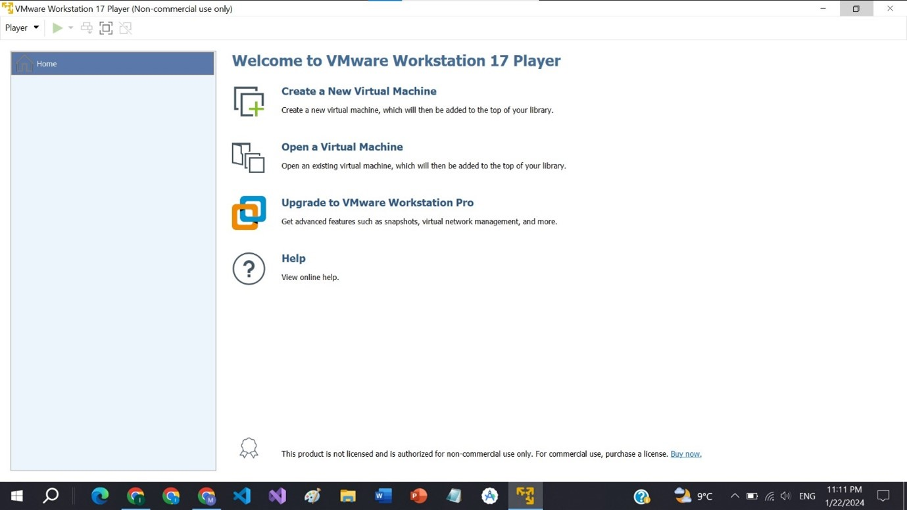
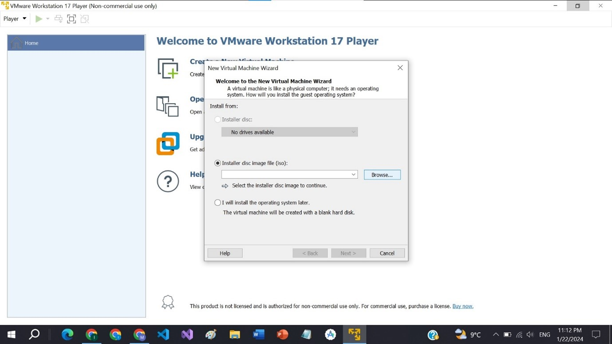
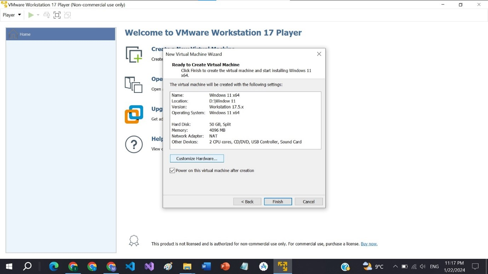
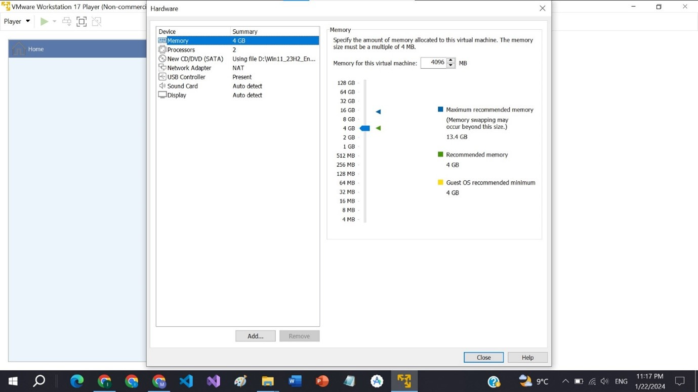
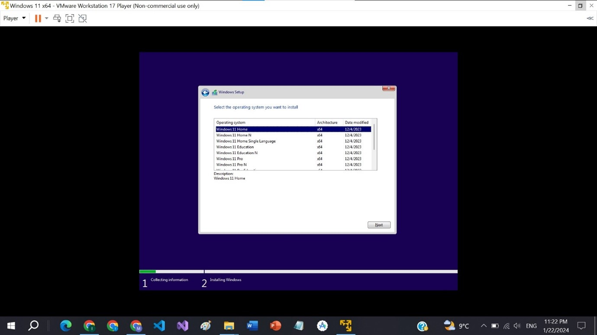
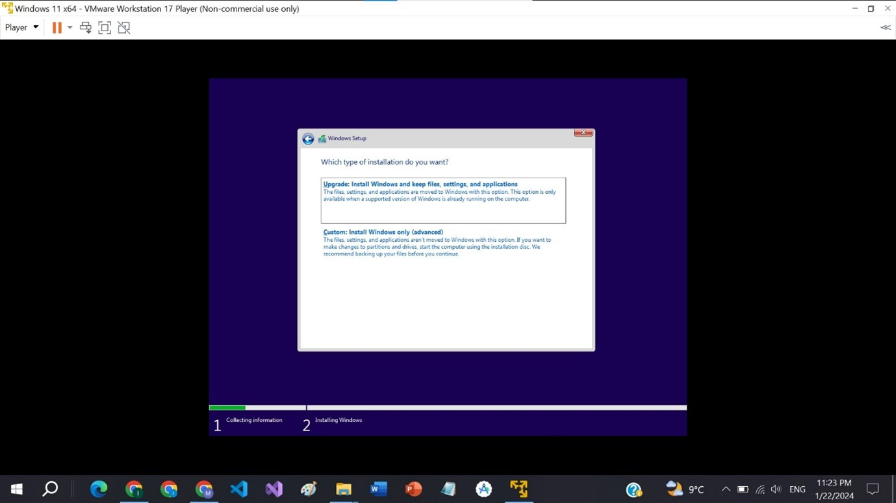
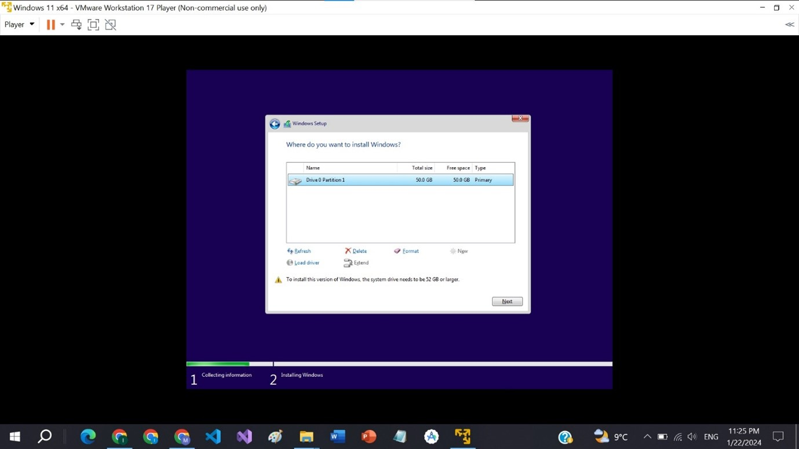

---

---

<h1 id="downloading-windows-11-in-virtual-machine">Downloading Windows 11 in Virtual Machine</h1>
<h2 id="step-1-download-vmware">Step 1: Download VMware</h2>
<ul>
<li>Open your web browser and go to Google.</li>
<li>Search for “VMware” and click on the first link.</li>
<li>Download VMware by following the provided link.</li>
</ul>

<h2 id="step-2-get-started">Step 2: Get Started</h2>
<ul>
<li>After downloading VMware, open the application.</li>
<li>Click on <strong>“GET STARTED”</strong> and proceed.</li>
</ul>

<h2 id="step-3-try-workstation-17-player-for-windows">Step 3: Try Workstation 17 Player for Windows</h2>
<ul>
<li>Click on <strong>"TRY WORKSTATION 17 PLAYER FOR WINDOWS."</strong></li>
</ul>

<h2 id="step-4-create-a-new-virtual-machine">Step 4: Create a New Virtual Machine</h2>
<ul>
<li>In VMware, click on <strong>"Create a New Virtual Machine."</strong></li>
</ul>

<h2 id="step-5-browse-iso-file">Step 5: Browse ISO File</h2>
<ul>
<li>Select your Windows 11 ISO file from your system and click on <strong>"Next."</strong></li>
</ul>

<h2 id="step-6-create-virtual-machine-password">Step 6: Create Virtual Machine Password</h2>
<ul>
<li>Create a password for your virtual machine and click <strong>"Next."</strong></li>
</ul>

<h2 id="step-7-select-storage">Step 7: Select Storage</h2>
<ul>
<li>Choose a storage location for your virtual machine and click on <strong>"Next."</strong></li>
<li></li>
</ul>

<h2 id="step-8-customize-hardware">Step 8: Customize Hardware</h2>
<ul>
<li>Customize the hardware settings by clicking on <strong>"Customize Hardware."</strong></li>
</ul>

<h2 id="step-9-allocate-memory">Step 9: Allocate Memory</h2>
<ul>
<li>Ensure a minimum of 4GB RAM is allocated. Adjust as needed based on your system specifications.</li>
<li>Click <strong>" Next."</strong></li>
</ul>

<h2 id="step-10-language-selection">Step 10: Language Selection</h2>
<ul>
<li>Select the default language and click <strong>"Next."</strong></li>
</ul>

<h2 id="step-11-install-windows-11">Step 11: Install Windows 11</h2>
<ul>
<li>Click on <strong>"Install Now."</strong></li>
<li>The Windows 11 installation process will begin.</li>
</ul>

<h2 id="step-12-select-windows-11-pro">Step 12: Select Windows 11 Pro</h2>
<ul>
<li>Choose <strong>“Windows 11 Pro”</strong> and click <strong>"Next."</strong></li>
</ul>

<h2 id="step-13-type-of-installation">Step 13: Type of Installation</h2>
<ul>
<li>Select <strong>“Install Windows only”</strong> and click <strong>"Next."</strong></li>
</ul>

<h2 id="step-14-choose-installation-disk">Step 14: Choose Installation Disk</h2>
<ul>
<li>Select the disk where you want to install Windows and click <strong>"Next."</strong></li>
</ul>

<h2 id="step-15-windows-installation">Step 15: Windows Installation</h2>
<ul>
<li>Windows will now complete the installation process.</li>
<li>Set up user accounts and follow any additional prompts.</li>
</ul>

<h2 id="step-16-successful-installation">Step 16: Successful Installation</h2>
<ul>
<li>Congratulations! Windows 11 has been installed successfully on your virtual machine.</li>
</ul>

You can now explore and use Windows 11 within the VMware virtual machine environment.

<h3 id="github-link">Github Link</h3>

<a href="https://github.com/JawadAli1133/OS_Labs">https://github.com/JawadAli1133/OS_Labs</a>

