---

---

<h1 id="shell-scripting">Shell Scripting</h1>

Mr. Tom is a new Ubuntu user. He wants guidance regarding shell scripting to perform the following tasks

<h2 id="task-1">Task 1</h2>

Create a simple script that takes two command line arguments and then multiplies them.

<h3 id="script">Script</h3>

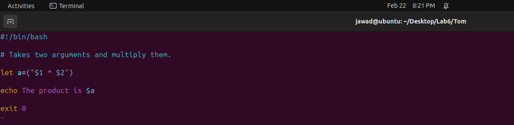

<h3 id="execution">Execution</h3>

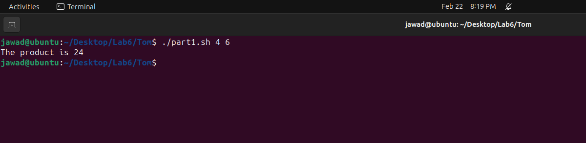

<h2 id="task-2">Task 2</h2>

Create a simple script, which will ask the user for a few pieces of information then combine this into a message which is echoed to the screen.

<h3 id="script-1">Script</h3>

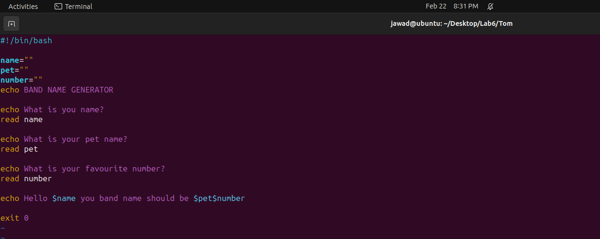

<h3 id="execution-1">Execution</h3>

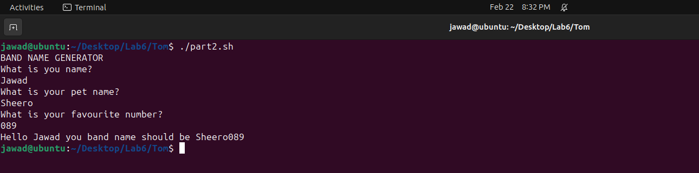

<h2 id="task-3">Task 3</h2>

Now Mr. Tom suddenly lost track of his current location. Help him find his location.

<h3 id="script-2">Script</h3>

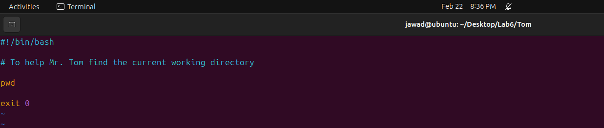

<h3 id="execution-2">Execution</h3>

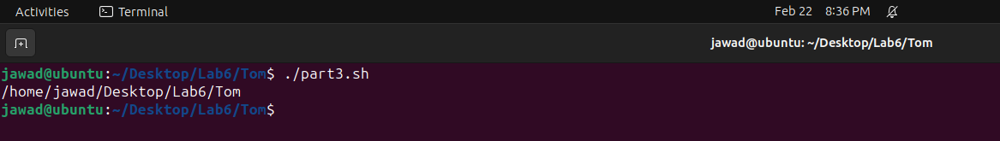

<h2 id="task-4">Task 4</h2>

He wants the list of all files present in the home directory.

<h3 id="script-3">Script</h3>

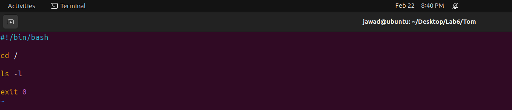

<h3 id="execution-3">Execution</h3>

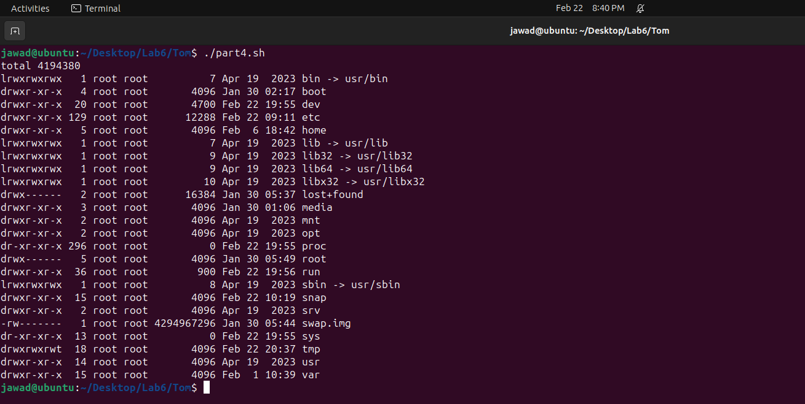

<h2 id="task-5">Task 5</h2>

Display the current time.

<h3 id="script-4">Script</h3>

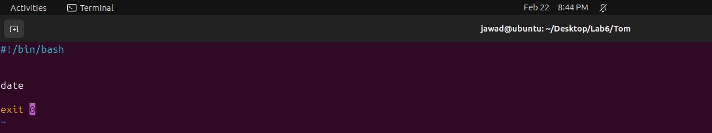

<h3 id="execution-4">Execution</h3>

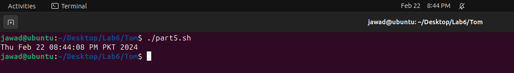

<h2 id="task-6">Task 6</h2>

He is done with the task and he is happy with your work. He wants to display a thank you message.

<h3 id="script-5">Script</h3>

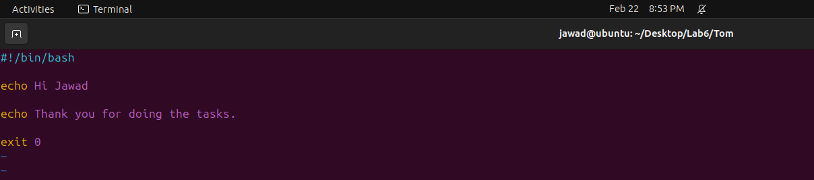

<h3 id="execution-5">Execution</h3>

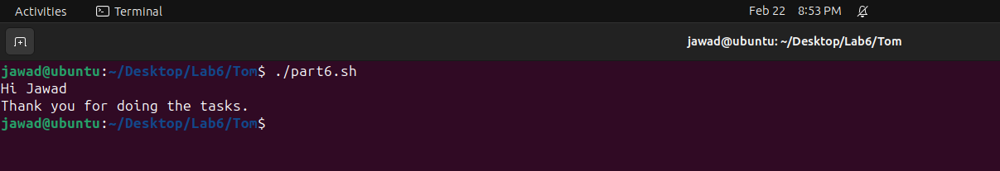

<h2 id="task-7">Task 7</h2>

Write a simple shell script that uses arithmetic operators (+, -,*) using double parenthesis while printing your roll # with the results of operations.

<h3 id="script-6">Script</h3>

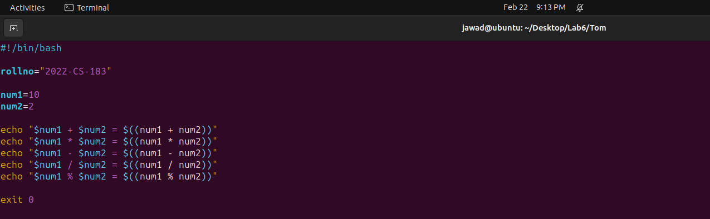

<h3 id="execution-6">Execution</h3>

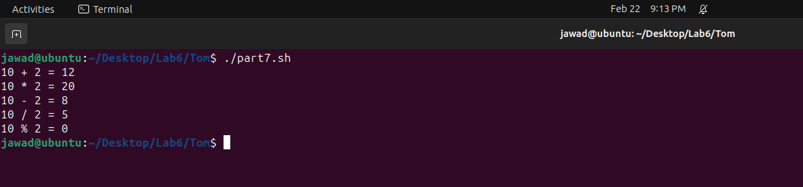

<h2 id="task-8">Task 8</h2>

Write a simple shell script that uses all relational operators to print your roll # with the results of operations.

<h3 id="script-7">Script</h3>

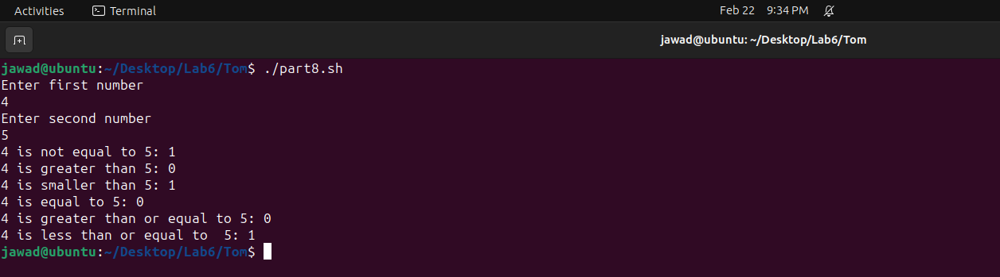

<h3 id="execution-7">Execution</h3>

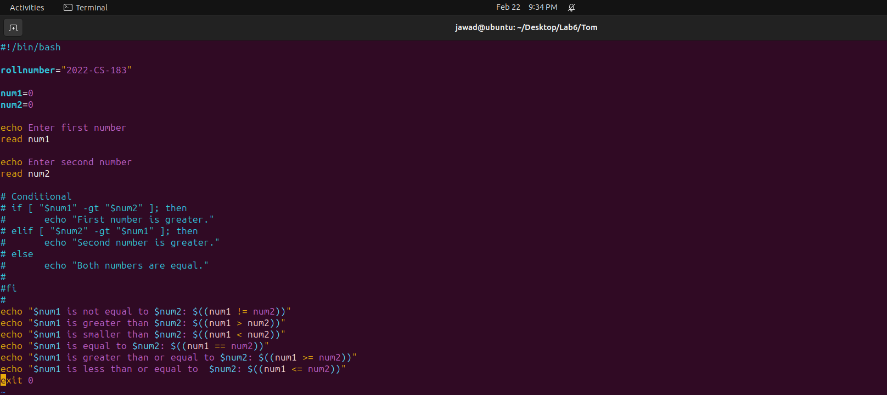

<h2 id="github-link">Github Link</h2>

<a href="https://github.com/JawadAli1133/OS_Labs">https://github.com/JawadAli1133/OS_Labs</a>

