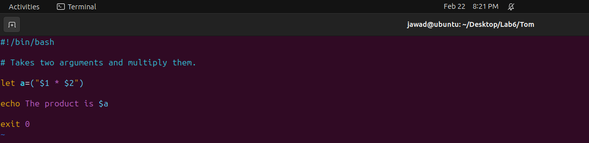
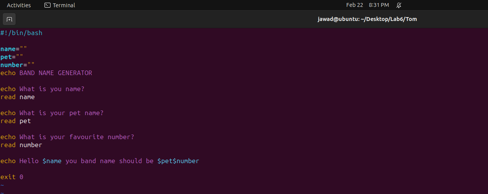
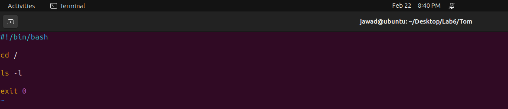
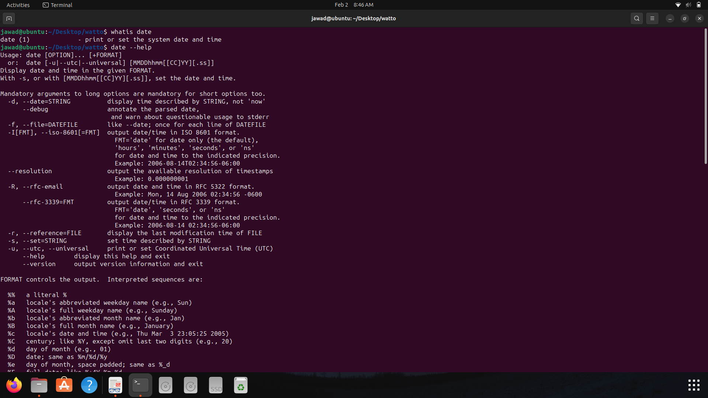

---

---

<h1 id="basic-linux-commands">Basic Linux Commands</h1>
<h2 id="lab-tasks">Lab Tasks</h2>
<h3 id="i.-echo-and-uptime-commands">i. echo and uptime commands</h3>
<ol>
<li><strong>"echo"</strong>: Prints text or variables to the terminal in Linux/Unix.</li>
<li><strong>"uptime"</strong>: Displays the system’s current uptime, showing how long the system has been running. 
</li>
</ol>
<h3 id="ii.-mkdir-pwd-and-ll-commands">ii. mkdir, pwd, and ll commands</h3>
<ol>
<li><strong>"mkdir"</strong>: Command in Linux/Unix used to create a new directory (folder).</li>
<li><strong>"pwd"</strong>: Prints the current working directory, showing the full path of the present working directory in the terminal.</li>
<li><strong>"ll"</strong>: Short for ‘ls -l,’ it lists detailed information about files and directories, including permissions, owner, group, size, and modification time. 
</li>
</ol>
<h3 id="iii.-absolute-and-relative-paths">iii. Absolute and Relative paths</h3>
<ol>
<li>An absolute path refers to the complete and exact location of a file or directory in the file system, starting from the root directory.</li>
<li>A relative path specifies the location of a file or directory with respect to the current working directory. 
</li>
</ol>
<h3 id="iv.-more-and-less-commands">iv. more and less commands</h3>
<ol>
<li><strong>"more"</strong>: Displays the contents of a file one screen at a time. Use spacebar to advance to the next page or the enter key to advance one line at a time. Press ‘q’ to exit.</li>
<li><strong>"less"</strong>: Similar to <strong>“more”</strong>, but with additional features. It allows both forward and backward navigation through the file. Use arrow keys, spacebar, and ‘q’ to quit. <strong>“less”</strong> also supports searching and other advanced features. 
</li>
</ol>
<h3 id="v.-ls--l-ls--a-ls--lt-and-ls--ltr-commands">v. ls -l, ls -a, ls -lt, and ls -ltr commands</h3>
<ol>
<li><strong>"ls -l"</strong>: Displays detailed information about files and directories.</li>
<li><strong>"ls -a"</strong>: Lists all files and directories, including hidden ones.</li>
<li><strong>"ls -lt"</strong>: Sorts the listing by modification time, newest first.</li>
<li><strong>"ls -ltr"</strong>: Sorts the listing by modification time, oldest first. 
</li>
</ol>
<h3 id="vi.-whatis---help-and-man-commands">vi. whatis, --help, and man commands</h3>
<ol>
<li><strong>"whatis"</strong>: Provides a brief description of a command.</li>
<li><strong>"–help"</strong>: Many Unix/Linux commands support the <em>“–help”</em> option, which displays a brief summary of the command and its options.</li>
<li><strong>"man"</strong>: Opens the manual (documentation) pages for a command, providing detailed information about its usage, options, and examples. 
</li>
</ol>
<h3 id="vii.-cat-etcpasswd-and-cat-etcgroup-commands">vii. cat /etc/passwd and cat /etc/group commands</h3>
<ol>
<li><strong>"cat /etc/passwd"</strong>: Displays the contents of the “/etc/passwd” file, containing information about user accounts on the system.</li>
<li><strong>"cat /etc/group"</strong>: Shows the contents of the “/etc/group” file, containing information about groups on the system. 
 
</li>
</ol>
<h3 id="viii.-id-who-and-last-commands">viii. id, who, and last commands</h3>
<ol>
<li><strong>"id"</strong>: Displays user and group IDs, along with additional information.</li>
<li><strong>"who"</strong>: Shows information about currently logged-in users.</li>
<li><strong>"last"</strong>: Provides a list of recent logins, including login times, durations, and IP addresses. 
</li>
</ol>
<h3 id="ix.-useradd-userdel-and-passwd-commands">ix. useradd, userdel, and passwd commands</h3>
<ol>
<li><strong>"useradd"</strong>: Adds a new user to the system.</li>
<li><strong>"userdel"</strong>: Deletes a user account from the system.</li>
<li><strong>"passwd"</strong>: Changes the password for a user account. 
</li>
</ol>
<h3 id="x.-chmod-command">x. chmod command</h3>

The <strong>“chmod”</strong> command in Unix/Linux is used to change the permissions of a file or directory. 

<ol>
<li>

<strong>Symbolic Mode:</strong>

<ul>
<li>To add read and write permissions for the owner of the file: <strong>"chmod u+rw file"</strong></li>
<li>To remove write permission for the group: <strong>"chmod g-w file"</strong></li>
<li>To add execute permission for others: <strong>"chmod o+x file"</strong></li>
</ul>
</li>
<li>

<strong>Numeric Mode:</strong>

<ul>
<li>To set read, write, and execute permissions for the owner, and only read permissions for the group and others: <strong>"chmod 744 file"</strong></li>
</ul>
</li>
</ol>
<h1 id="task-01">Task 01</h1>
<h2 id="step-1.">Step 1.</h2>

Create a file 19f-XXXX.txt and jawad.txt and write 15 lines in both of them. 

<h2 id="step-2.">Step 2.</h2>
<ol>
<li>Merge both the files into a new file merge.txt.</li>
<li>Print the first and last two lines using head and tail commands. 
</li>
</ol>
<h2 id="step-3.">Step 3.</h2>

Search the roll number using grep command. 

<h2 id="step-4.">Step 4.</h2>
<ol>
<li>Grant the execute permission of the second file to the group.</li>
<li>Remove the writing permission for the owner.</li>
<li>Print the working directory using <strong>“pwd”</strong>.</li>
<li>Print the list of files using ls -l. Create a folder for pictures and files using <strong>“mkdir”</strong>.</li>
<li>Display the current date and time using <strong>“date”</strong>.</li>
<li>Display a thank you message using <strong>“echo”</strong>. 
</li>
</ol>
<h1 id="task-02">Task 02</h1>
<ol>
<li>Create a file named <strong>“19f-XXXX_OS-Lab_rules.txt”</strong>.</li>
<li>Open it and write all the lab rules in it. 
</li>
<li>Now use the derived number to change the permission of a file using <strong>“chmod”</strong> command.</li>
<li>Append the output of ls command to the created file. 
</li>
</ol>
<h2 id="the-file-data">The file data:</h2>

