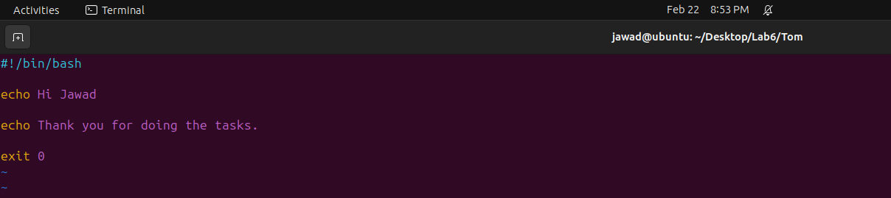

---

---

<h1 id="installing-ubuntu-in-vm-ware">Installing Ubuntu in VM Ware</h1>
<h2 id="step-1-download-vmware-and-the-ubuntu-iso-file">Step 1: Download VMware and the Ubuntu ISO File</h2>
<h3 id="download-vmware-workstation">Download VMware Workstation:</h3>
<ol>
<li>Visit the official VMware website at <a href="https://www.vmware.com/">vmware.com</a>.</li>
<li>Look for the VMware Workstation product and navigate to the download section.</li>
<li>Click on the option that says <strong>“Try Workstation 17 Player for Windows”</strong> to download the installer.</li>
</ol>
<h2 id="step-2-create-a-new-virtual-machine">Step 2: Create a new Virtual Machine</h2>
<ol>
<li>Once the VMware Workstation is installed, open the application.</li>
<li>Click on <strong>“Create a New Virtual Machine”</strong> to start the virtual machine creation wizard.</li>
</ol>

<h2 id="step-3-select-the-iso-file">Step 3: Select the ISO file</h2>
<ol>
<li>During the virtual machine creation process, you’ll be prompted to select the installation method. Choose <strong>“Installer disc image file (iso)”</strong>.</li>
<li>Click <strong>“Browse”</strong> to locate and select the Ubuntu ISO file you’ve downloaded.</li>
<li>Proceed to the next step by clicking <strong>“Next”</strong>.</li>
</ol>

<h2 id="step-4-set-username-and-password">Step 4: Set Username and Password</h2>
<ol>
<li>Enter the name for your Linux distribution (e.g., Ubuntu).</li>
<li>Choose a username and set a password for your Ubuntu system.</li>
<li>Click <strong>“Next”</strong> to continue.</li>
</ol>

<h2 id="step-5-set-path-for-virtual-machine">Step 5: Set Path for Virtual Machine</h2>
<ol>
<li>Specify a name and location for your virtual machine.</li>
<li>Click <strong>“Next”</strong> to proceed.</li>
</ol>

<h2 id="step-6-give-disk-space-to-your-virtual-machine">Step 6: Give Disk Space to Your Virtual Machine</h2>
<ol>
<li>Determine the amount of disk space you want to allocate to your Ubuntu virtual machine.</li>
<li>Click <strong>“Next”</strong> to move on.</li>
</ol>

<h2 id="step-7-customize-the-hardware-for-virtual-machine">Step 7: Customize the Hardware for Virtual Machine</h2>
<ol>
<li>Adjust hardware settings such as the number of processors, amount of RAM, and other options based on your system’s capabilities.</li>
<li>Click <strong>“Next”</strong> to proceed.</li>
</ol>

<h2 id="step-8-wait-for-ubuntu-to-install">Step 8: Wait for Ubuntu to Install</h2>
<ol>
<li>The Ubuntu installation process will begin. Wait for the system to copy files and install the operating system.</li>
</ol>

<h2 id="step-9-set-username-and-password">Step 9: Set Username and Password</h2>
<ol>
<li>During the Ubuntu installation, you’ll be asked to set a username and password for your Ubuntu user account.</li>
<li>Provide the required information and wait for the installation to complete.</li>
</ol>

<h2 id="step-10-complete-the-installation">Step 10: Complete the Installation</h2>
<ol>
<li>Once the installation is finished, Ubuntu will prompt you to remove the installation medium (the ISO file). Follow the instructions to eject the virtual disk and press Enter.</li>
</ol>
<h2 id="step-11-install-gcc">Step 11: Install gcc</h2>

Open the terminal in Ubuntu and execute the following command to install the GCC compiler for the C language: 
<strong>"sudo apt install gcc"</strong> 
If prompted, type ‘y’ and press Enter to confirm the installation. 

<h2 id="step-12-write-code-in-c-language">Step 12: Write code in C language</h2>

Open a text editor and write a simple “Hello World” program in C. Save the file as <strong>"code1.c"</strong> 

<h2 id="step-13-run-your-code">Step 13: Run your code</h2>

In the terminal, convert your C code into an executable file named <strong>“code1.exe”</strong> using the following commands: 
<strong>"gcc code1.c -o code1.exe"</strong> 
Now run you file by writing the command. 
<strong>"./code1.exe"</strong> 
You should see the “Hello World” output. 

<h2 id="step-14-install-g">Step 14: Install g++</h2>

Open the terminal in Ubuntu and execute the following command to install the G++ compiler for the C++ language: 
<strong>"sudo apt install g++"</strong> 
If prompted, type ‘y’ and press Enter to confirm the installation. 

<h2 id="step-15-write-code-in-c-language">Step 15: Write code in C++ language</h2>

Open a text editor and write a simple “Hello World” program in C. Save the file as <strong>“code.cpp”</strong>. 

<h2 id="step-16-run-your-code">Step 16: Run your code</h2>

In the terminal, convert your C++ code into an executable file named <strong>“code.exe”</strong> using the following commands: 
<strong>"g++ code.c -o code.exe"</strong> 
Now run you file by writing the command. 
<strong>"./code.exe"</strong> 
You should see the “Hello World” output. 

